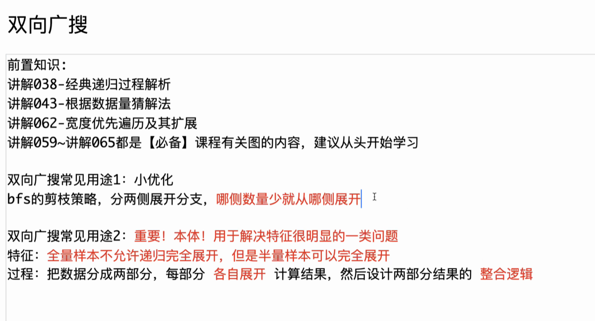
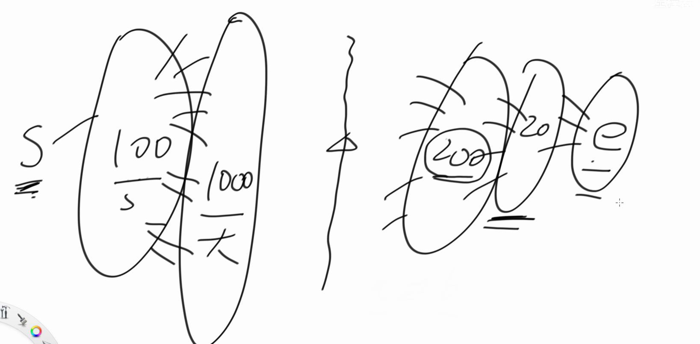
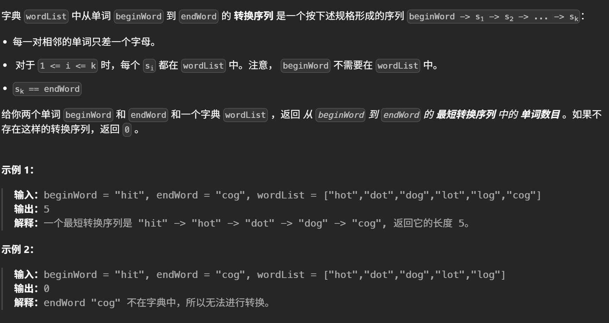

# 双向广搜 / 折半so'suo



## 用途1 bfs剪枝小优化

找起点到终点的最短路径， 等于终点到起点的距离，选择比较优的一侧展开



#### eg1. [127. 单词接龙 - 力扣（LeetCode）](https://leetcode.cn/problems/word-ladder/)




```cpp
int solve(string begin, string end, vector<string> wordlist){
    unordered_set<string> word;
    for(auto s : wordlist) {
        word.insert(s);
    }
    unordered_set<string> less;
    unordered_set<string> much;
    unordered_set<string> next_level;
    less.insert(begin);
    much.insert(end);
    for(int len = 2; !less.empty(); ++len) {
        for(string s: less) {
            for(int j = 0; j < s.size(); ++j) {
                char old = s[j];
                for(char c = 'a'; c <= 'z'; ++c) {
                    if(c!=old) {
                        s[j]=c;
                        if(much.find(s) != much.end()) {
                            return len;
                        }
                       if(word.find(s) != word.end()) {
                               next_level.insert(s);

                           word.erase(s);
                       }
                    }
                }
                s[j] = old;

            }
        }
        if(next_level.size() < much.size()) {
            less = next_level;
            next_level.clear();
        } else {
            less = much;
            much = next_level;
            next_level.clear();
        }
    }
    return 0;
}
```


## 用途2 分治

> 全量数据不可信，需要暴力展开, $2^{40} \to 2 \times 2^{20} $ 分批展开，整合结果。

[P4799 [CEOI 2015\] 世界冰球锦标赛 (Day2) - 洛谷](https://www.luogu.com.cn/problem/P4799)


